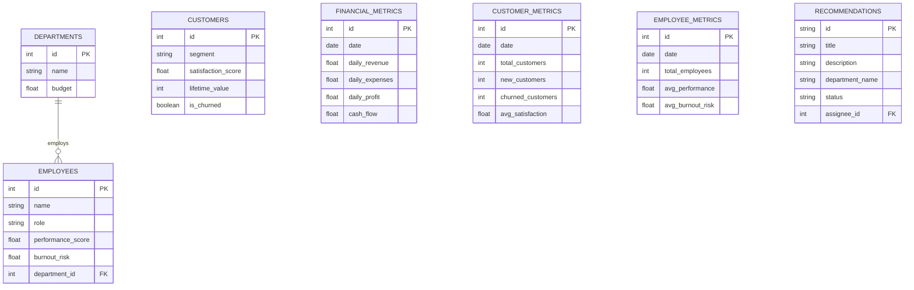

# Database Documentation

BoardMind uses a relational database design, implemented via SQLAlchemy ORM. The production standard is PostgreSQL.

## Entity-Relationship Diagram

## Table Descriptions

### Operational Data
- **departments:** Tracks business units and their allocated budgets.
- **employees:** Tracks individual staff, their roles, and dynamic burnout/performance scores.
- **customers:** Tracks individual customers, segmented lifetime value, and churn state.

### Time-Series Data (Simulator Outputs)
- **financial_metrics:** Aggregated daily fiscal performance.
- **customer_metrics:** Aggregated daily customer acquisition, retention, and satisfaction.
- **employee_metrics:** Aggregated daily workforce health and output.

### Application State
- **recommendations:** Stores AI-generated strategic actions. Tracks lifecycle state (`Pending`, `Approved`, `Assigned`, `Completed`) and links to `employees` for assignment.

## Indexes & Performance
Primary keys are strictly enforced on integer `id` columns.
`date` columns on time-series tables are intrinsically queried by the Analytics Engine and should be indexed in production deployments to optimize `SUM()` and `AVG()` queries over trailing 30-day windows.
