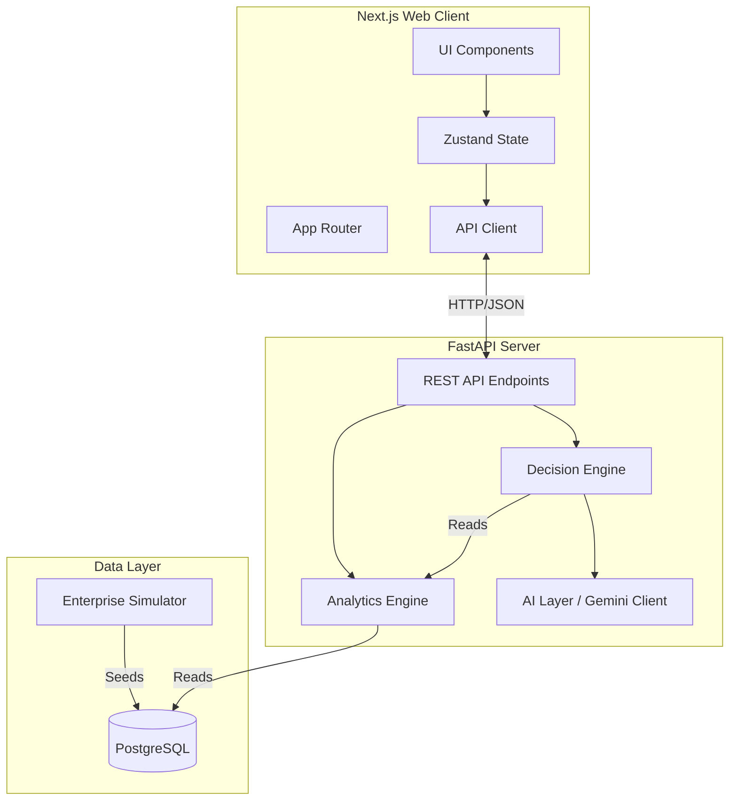

# System Architecture

The BoardMind platform is constructed using a decoupled client-server architecture, connecting a modern React frontend with an intelligent Python backend.

## Overall Architecture Diagram



## Component Responsibilities

1. **Enterprise Simulator (`backend/app/simulator/`)**
   - A deterministic data generator that builds chronological history for the business (Financial, Customer, Employee metrics).
   - Serves as the single source of truth for the application state.

2. **Analytics Engine (`backend/app/engine/analytics.py`)**
   - Purely deterministic engine that queries the database.
   - Calculates Key Performance Indicators (KPIs), trends, and the Business Health Score.

3. **Decision Engine (`backend/app/engine/decision.py`)**
   - An expandable rule registry that processes output from the Analytics Engine.
   - Identifies anomalies (e.g., severe revenue drop, burnout spike) and constructs "actionable insights" to be sent to the AI layer.

4. **AI Layer (`backend/app/ai/gemini_client.py`)**
   - Wraps the Google Generative AI API.
   - Accepts context from the Decision Engine to draft human-readable, strategic recommendations.

5. **FastAPI Backend (`backend/app/`)**
   - Exposes standard REST endpoints.
   - Enforces schema validation using Pydantic.
   - Implements dependency injection for database sessions.

6. **Next.js Frontend (`frontend/src/`)**
   - Handles presentation, routing, and user interaction.
   - Employs a premium, glassmorphism-inspired dark mode UI.

## Data Flow

1. Data is seeded into the database by the **Simulator**.
2. When the user requests the Dashboard, the Frontend hits the `GET /api/v1/dashboard/brief` endpoint.
3. The Backend initializes the **Analytics Engine** to calculate the current health and KPIs.
4. The **Decision Engine** evaluates these KPIs against registered rules.
5. Detected anomalies are sent to the **Gemini AI Client**, which formats a list of strategic recommendations.
6. The combined payload is serialized via Pydantic and returned to the Frontend for rendering.

## Folder Structure

```text
BoardMind/
├── backend/
│   ├── app/
│   │   ├── ai/            # Gemini client integration
│   │   ├── api/v1/        # FastAPI routers
│   │   ├── engine/        # Analytics and Decision engines
│   │   ├── simulator/     # Data generation logic
│   │   ├── models.py      # SQLAlchemy ORM definitions
│   │   ├── schemas.py     # Pydantic validation models
│   │   └── main.py        # ASGI application entrypoint
│   └── tests/             # Pytest automated suite
└── frontend/
    ├── src/
    │   ├── app/           # Next.js App Router pages
    │   ├── components/    # Reusable UI components
    │   ├── lib/           # Utility functions and API clients
    │   └── store/         # Zustand state management
    └── tailwind.config.ts # Styling configuration
```
